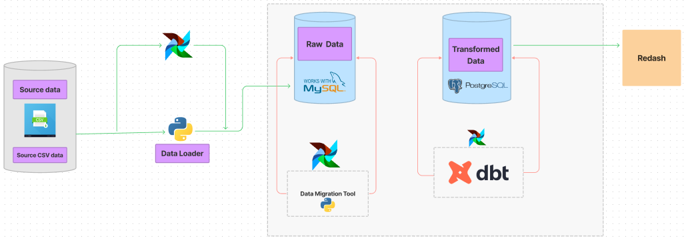

# Data Warehouse ELT

Scalable data warehouse that will host the vehicle trajectory data extracted by analysing footage taken by swarm drones and static roadside cameras.

## Pipeline Design



## Prerequisites

Docker must be installed on local machine.

- Docker
- DockerCompose

### Installation

Clone the repo

```
git clone https://github.com/Melak2017/Data-warehouse-sensor-data-ELT.git
```

License  
Distributed under the MIT License.

Contact  
Melaku Mekonnen - melakuandarge100@gmail.com

Acknowledgements  
10 Academy
